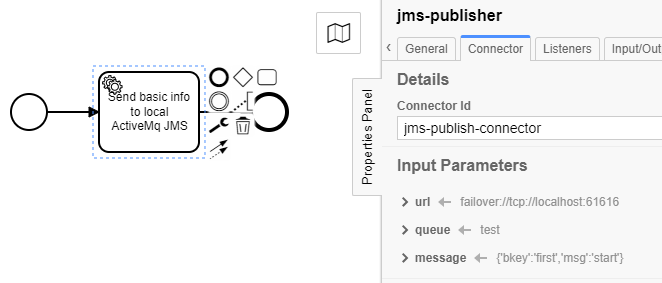

## About The Project

Camunda JMS Connector is a Camunda Connect plugin extension that allows to enqueue and dequeue messages on Java Message Service in any project that uses Cammunda Engine with BPMN processes.
It is fully customizable and by using it in a project, a user can model a BPMN process where it is possible to enqueue any messages on a particular instance of JMS. JMS Connector also features
receiving messages from  the desirable queue and upon receiving the payload it triggers a message in the Camunda Engine, which ultimately can start a new instance of a process or continue an 
existing one depending on how the connector and a processes are customized.


### Built With

* []() Java
* []() Spring Boot
* []() Camunda Engine
* []() Camunda Connect extension
* []() Camunda Modeler
* []() ActiveMQ JMS

## Getting Started

To get a local copy up and running follow these simple steps.

### Prerequisites

* []() clone Camunda JMS Connector repository
* []() get your favourite IDE
* []() Maven
* []() ActiveMQ - a local instance in Docker should do
* []() Camunda Modeler

### Installation

1. **Customize listener**  
	* To choose the queue that you want to listen get into `TransactionReceiver.java` and change the value of **destination** in `@JmsListener` annotation.
	* To choose the instance of a JMS that you would like to listen get into your project and customize necessary variables in `application.properites`.
```properties
# Example application.properites

# activemq credentials
spring.activemq.user=admin
spring.activemq.password=admin

# activemq url
spring.activemq.broker-url=tcp://localhost:61616?jms.redeliveryPolicy.maximumRedeliveries=1

# json keys that you would like your listener should look for

# key for an id of an instance of a process 
json.instanceid=bkey

# key for a message that you would like to send
json.payload=msg
```  

2.  **Customize publisher**
	* Select `service-task` in cammunda modeler block and customize it according to your needs. Example customization below will enqueue on `test` queue that is run on an `failover://tcp://localhost:61616` address a message that is a json - `{'bkey':'first','msg':'start'}`. Mind the fact that those values reflect on how you customized your listener. JMS Connector's Id is **jms-publish-connector**. It is very important as it points out which connector you would like to use.  


3.  **Build the project**    
    * run `mvn package` in respository directory  
4.  **Use output JAR's as external library**  
   In `\target` directory of listener and publisher you will find both fat jars and light jars. Use one of them regarding your project preferences.
	
## Contributing

Any contributions you make are **greatly appreciated**.

## License

Software is licensed under [MIT License](LICENSE).

## Contact

[@devapo](https://devapo.io/)

Project Link: [https://github.com/](https://github.com/)
